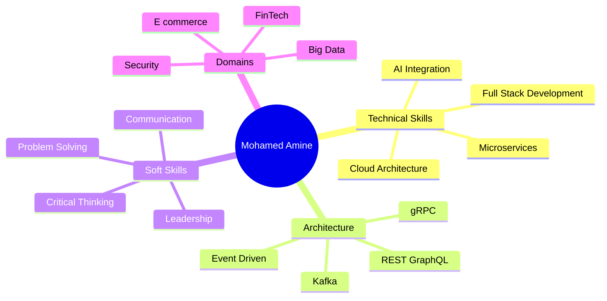

<div align="center">

<!-- BMA Brand Logo -->


<br/>

<!-- Animated Typing Header -->
<a href="https://boussaidmohamedamine.online">
  
</a>

<br/>

<!-- Animated Wave -->


<!-- Profile Views Counter -->


<!-- Social Links with Icons -->
<p align="center">
  <a href="https://boussaidmohamedamine.online" target="_blank">
    
  </a>
  <a href="https://linkedin.com/in/Boussaid001" target="_blank">
    
  </a>
  <a href="mailto:mohamedamine.boussaid@polytechnicien.tn">
    
  </a>
  <a href="https://github.com/Boussaid001" target="_blank">
    
  </a>
</p>

</div>

---

## 👨‍💻 About Me

```typescript
const mohamedAmine = {
    location: "Sousse, Tunisia 🇹🇳",
    education: "Software Engineering @ Polytechnic Sousse",
    currentFocus: ["Full-Stack Development", "Cloud Architecture", "AI Integration"],
    lookingFor: "Internship Opportunities",
    
    lifePhilosophy: "Building scalable solutions that combine technical excellence with exceptional UX",
    
    techStack: {
        languages: ["JavaScript/TypeScript", "Python", "Golang", "Java", "Dart", "C++", "Scala"],
        frontend: ["React", "Angular", "Flutter", "PWA", "Tailwind CSS"],
        backend: ["Node.js", "Express.js", "Golang/Gin", "Django", "Spring Boot"],
        databases: ["PostgreSQL", "MongoDB", "MySQL", "Redis", "Firebase"],
        cloudDevOps: ["Docker", "Kubernetes", "Nginx", "PM2", "CI/CD"],
        aiData: ["OpenAI GPT", "NLP", "Apache Spark", "Hadoop", "TensorFlow"]
    },
    
    architecture: ["Microservices", "Event-Driven (Kafka)", "REST/GraphQL APIs", "gRPC"],
    
    certifications: ["Cisco DevNet Associate", "CCNA", "SFPC™ Scrum", "MongoDB"]
};
```

---

## 🚀 Featured Projects

<table>
<tr>
<td width="50%">

### 🏠 SmartMoney Platform
**Canadian Immigration & Investment Solution**

[](https://smartmoney.com)


**Features:**
- 🏘️ Real estate management
- 📈 Financial markets integration
- 🤖 AI-powered financial assistant
- 🔐 OAuth2.0 authentication
- ⚡ PWA with offline support

**Tech:** React • Node.js • Express.js • MongoDB • PostgreSQL • OpenAI API • PWA

</td>
<td width="50%">

### 💰 EarnBits Platform
**Digital Advertising & Rewards Platform**

[](https://earnbits.demo)


**Features:**
- 📊 Campaign management
- ⏱️ Real-time bidding
- 💳 Stripe payment processing
- 🐳 Containerized microservices
- 🔄 CI/CD pipeline

**Tech:** Angular • TypeScript • Golang • PostgreSQL • Docker • Stripe API

</td>
</tr>

<tr>
<td width="50%">

### 🛒 Vahila Backend
**E-commerce Microservices Platform**


**Architecture:**
- ⚡ Event-driven with Kafka
- 🔌 gRPC microservices
- 📡 GraphQL & REST APIs
- 🗄️ MongoDB & Redis caching
- 🔑 JWT authentication

**Tech:** Node.js • Docker • Kafka • gRPC • GraphQL • MongoDB • Redis

</td>
<td width="50%">

### 🤖 YouTube Auto Responder
**AI-Powered Comment Response System**


**Features:**
- 🧠 GPT-4 integration
- 💬 Sentiment analysis
- 📺 YouTube API integration
- ⚡ Real-time monitoring
- 🎯 Contextual responses

**Tech:** Python • OpenAI GPT-4 • YouTube API • Flask • SQLite • NLP

</td>
</tr>
</table>

---

## 💼 Professional Experience

<details open>
<summary><b>🚀 AltaDigit - Summer Intern</b> <i>(July 2025 - September 2025)</i></summary>
<br/>

- 🏗️ Developed **SmartMoney** platform for Canadian immigration & investment
- 🔐 Implemented secure authentication with OAuth2.0 and Google OAuth
- 🤖 Integrated AI-powered financial assistant using OpenAI API
- 🏠 Built real estate management and financial markets features
- ☁️ Deployed on VPS with Nginx, SSL/TLS, and PM2 for production-grade performance

</details>

<details>
<summary><b>🛡️ TUDIGISEC - Summer Intern</b> <i>(July 2024 - September 2024)</i></summary>
<br/>

- 🏢 Developed security platform with **multi-tenancy architecture**
- 📝 Contributed to specifications and conceptual design
- 🔒 Implemented security best practices and access control

</details>

<details>
<summary><b>☁️ Tunisian Cloud - Bachelor's Degree Intern</b> <i>(Feb 2023 - June 2023)</i></summary>
<br/>

- 📊 Built **agile and predictive project management platform**
- 📐 Created comprehensive technical specifications
- 🏗️ Designed scalable architectural documentation

</details>

<details>
<summary><b>🎙️ TITC - Co-founder</b> <i>(Dec 2021 - Jan 2025)</i></summary>
<br/>

- 🎤 Led online event podcasts across Tunisia
- 👥 Built IT community initiatives
- 🎨 Managed graphic design and IT infrastructure

</details>

---

## 🛠️ Technology Arsenal

### Languages
<p align="left">
  
</p>

### Frontend Development
<p align="left">
  
</p>

### Backend Development
<p align="left">
  
</p>

### Databases & Caching
<p align="left">
  
</p>

### DevOps & Cloud
<p align="left">
  
</p>

### AI & Data Engineering
<p align="left">
  
  
  
  
  
</p>

### Tools & Others
<p align="left">
  
</p>

---

## 📊 GitHub Statistics

<div align="center">
  
  
</div>

<div align="center">
  
</div>

### 🏆 GitHub Trophies
<div align="center">
  
</div>

### 📈 Contribution Graph
<div align="center">
  
</div>

---

## 🎨 Advanced Profile Animations

<div align="center">

<table>
<tr>
<td width="50%" valign="top">

### 🎯 3D Contribution Graph

<div align="center">
  
</div>

</td>
<td width="50%" valign="top">

### 🐍 Contribution Snake Animation

<div align="center">
  <picture>
    <source media="(prefers-color-scheme: dark)" srcset="https://raw.githubusercontent.com/Boussaid001/Boussaid001/output/github-contribution-grid-snake-dark.svg">
    <source media="(prefers-color-scheme: light)" srcset="https://raw.githubusercontent.com/Boussaid001/Boussaid001/output/github-contribution-grid-snake.svg">
    
  </picture>
</div>

</td>
</tr>
</table>

<div align="center" style="margin-top: 20px;">
  <i>🎨 Animations auto-update every 6 hours • Powered by GitHub Actions • BMA Brand 🎨</i>
</div>

</div>

---

## 🎓 Certifications & Education

<table>
<tr>
<td width="50%" valign="top">

### 🎓 Education
- **Polytechnic Sousse** (2023-2026)
  - Software Engineering
- **ISIMM Monastir** (2020-2023)
  - Bachelor's in Computer Science

</td>
<td width="50%" valign="top">

### 📜 Certifications
- 🌐 **Cisco DevNet Associate** (2025-2027)
- 🔧 **CCNA 1 & 2** (2024-2026)
- 📋 **SFPC™ Scrum** (2024-2026)
- 🗃️ **MongoDB Certification** (2024-2026)

</td>
</tr>
</table>

---

## 🌟 Community & Leadership

<div align="center">

| Organization | Role | Period |
|-------------|------|--------|
| 🔬 **IEEE** | Member | 2024 - Present |
| 💻 **ACM EPS Club** | Member | 2024 - 2025 |
| 🎨 **CPU ISIMM** | Graphic Designer | 2021 - 2023 |
| 🌟 **Young Creative Minds** | Vice President | 2019 - 2021 |

</div>

---

## 🌐 Languages

<div align="center">

| Language | Level |
|----------|-------|
| 🇹🇳 **Arabic** | Native |
| 🇫🇷 **French** | DELF B2 |
| 🇬🇧 **English** | B2 |

</div>

---

## 💡 Core Competencies

<div align="center">



</div>

---

## 📫 Let's Connect!

<div align="center">


<br/><br/>

<p>
  <a href="https://boussaidmohamedamine.online" target="_blank">
    
  </a>
</p>

<p>
  <a href="mailto:mohamedamine.boussaid@polytechnicien.tn">
    
  </a>
  <a href="https://linkedin.com/in/Boussaid001" target="_blank">
    
  </a>
  <a href="https://github.com/Boussaid001" target="_blank">
    
  </a>
</p>

---


<sub>⭐️ From [Boussaid001](https://github.com/Boussaid001) with 💙</sub>

</div>

---

<!-- Visitor Counter -->
<div align="center">
  
</div>
